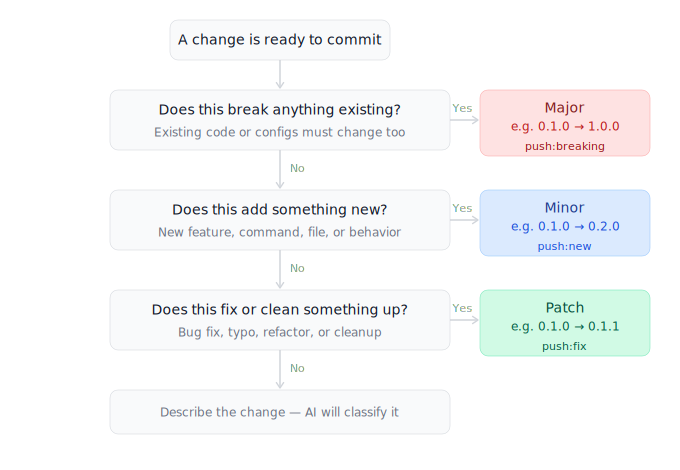

# Contributing to {{PROJECT_NAME}}

This document defines how {{PROJECT_NAME}} is versioned, released, and maintained. These rules apply to all changes — documentation, configuration, and code.

---

## Versioning

{{PROJECT_NAME}} uses Semantic Versioning (`MAJOR.MINOR.PATCH`). All projects start at `0.1.0`.

| Change | Bump | Example |
| --- | --- | --- |
| Bug fix, typo, small correction | PATCH | `0.1.1` → `0.1.2` |
| New feature or section, nothing breaks | MINOR | `0.1.2` → `0.2.0` |
| Breaking architectural change | MAJOR | `0.2.0` → `1.0.0` |

### Where the version lives

The version must be identical in every location it appears.

| Location | Notes |
| --- | --- |
| `VERSION` | Repo root. Canonical source of truth. Always present. |
| `{{PROJECT_NAME}}.md` header | Always matches `VERSION`. |
| `CHANGELOG.md` | Every release entry carries the version. |
| `package.json` | JS/TS projects only. `"version"` field must match `VERSION`. |
| Git tag | `vX.Y.Z` applied at every release. |
| GitHub Release | Created from the git tag. |

---

## Push commands

Use one of these commands in your AI tool when you are ready to commit and push. Never use bare "push" — it will not be accepted without a qualifier.

| Command | Bump | Version change |
| --- | --- | --- |
| `push:breaking` | Major | `0.1.0 → 1.0.0` |
| `push:new` | Minor | `0.1.0 → 0.2.0` |
| `push:fix` | Patch | `0.1.0 → 0.1.1` |

Not sure which one to use? The decision tree below walks you through it.

---

## Which command do I use?



Read it top to bottom. Answer each question. The first **Yes** determines your command.

---

## Release process

When you issue a push command, the AI tool presents a **single confirmation prompt** and then runs `bin/release` — one command that does everything.

1. **Presents a release summary** — current version, new version, and the changelog entries to be released.
2. **Waits for one confirmation** — does not modify any file until you say "yes." This is the only prompt.
3. **Runs `bin/release <type>`** — a single command that handles the entire release:
   - Bumps the version in `VERSION`, project `.md` header, and `package.json` (if present)
   - Moves `[Unreleased]` entries in `CHANGELOG.md` into a new versioned section with today's date
   - `git add -A && git commit`
   - `git tag -a vX.Y.Z`
   - `git push origin main && git push origin vX.Y.Z`
   - `gh release create vX.Y.Z`

You can also run `bin/release` directly from the terminal without an AI agent:

```
bin/release patch   # push:fix
bin/release minor   # push:new
bin/release major   # push:breaking
```

---

## Skill commands

Skills are specialised behavioral modules in `skills/`. Each skill defines a focused identity and rules for a specific type of work. Invoke them explicitly with their commands — there are no automatic triggers. Each skill file lists its own commands in a `## Commands` table. See `COMMANDS.md` for the full list.

---

## Updating AI tool files

`CLAUDE.md`, `.cursorrules`, and `.github/copilot-instructions.md` are generated files. Never edit them directly.

To update them — after adding a skill or editing `project.md`:

```
bash skills/sync.sh
```

Commit the regenerated files along with the change that prompted the sync.
