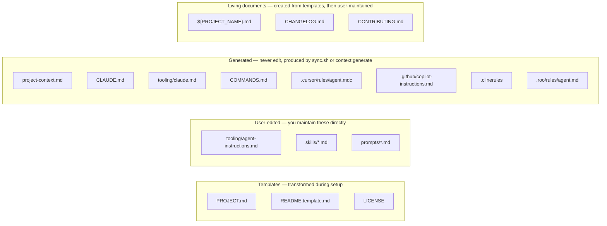
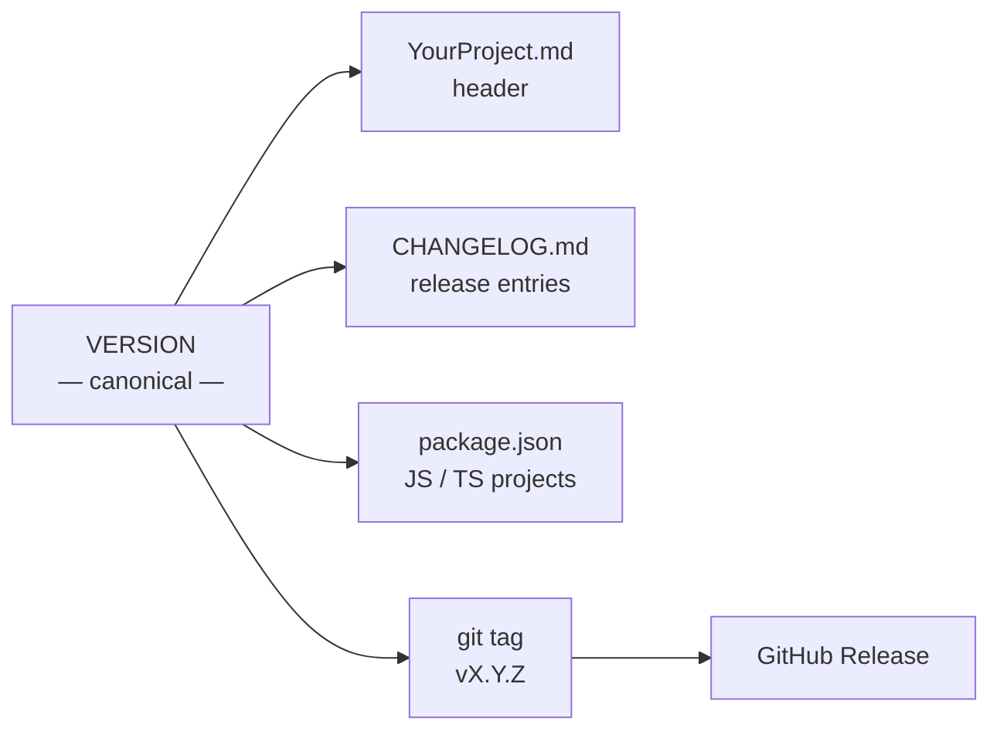
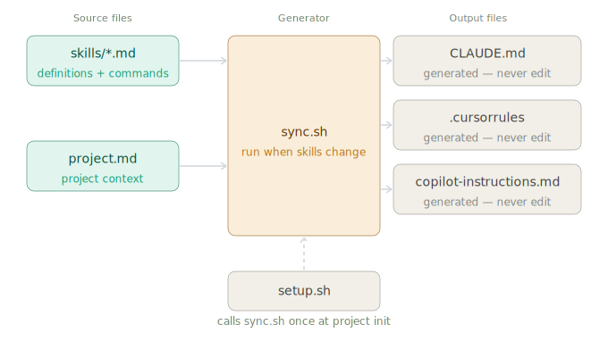
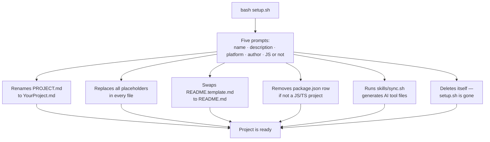

# Project Scaffold

**The project foundation you rebuild every time, built once.**

A GitHub template repository that gives every new project a professional-grade documentation system, automatic version discipline, AI agent instructions that generate themselves, and skill commands — configured in five minutes, enforced forever.

---

## The problem

Starting a new project means making the same decisions and doing the same manual work every time. How should the system be documented? Where do version numbers live? How do changes get recorded? What context do AI tools need? What commands should they accept?

Without a deliberate foundation, things drift. Documentation goes stale. Changelogs go unwritten. Version numbers appear in three files and disagree. AI tools make changes without context, skip the release process, and require constant re-instruction.

| Without a scaffold | With this scaffold |
| --- | --- |
| Docs set up differently every time | One template, consistent structure every project |
| Version numbers drift between files | One canonical number, propagated everywhere |
| Changelogs forgotten after the first week | Every change documented, automatically prompted |
| AI tools have no project context or rules | Standing orders generated from your skills directory |
| Release process done from memory | Three commands: `push:breaking`, `push:new`, `push:fix` |
| Skills re-explained every session | Skill commands registered once, available forever |

---

## What you get

```
your-project/
├── README.md                          ← project README (personalised during setup)
├── YourProject.md                     ← living system document — always current
├── project-context.md                 ← generated — run context:generate to update
├── CLAUDE.md                          ← generated — never edit directly
├── COMMANDS.md                        ← generated — never edit directly
├── .cursor/rules/agent.mdc            ← generated — never edit directly
├── CONTRIBUTING.md                    ← versioning rules and push commands
├── CHANGELOG.md                       ← chronological change record
├── VERSION                            ← single canonical version number
├── LICENSE                            ← MIT, with your name and year
├── .gitignore                         ← sensible defaults for most stacks
├── assets/
│   ├── scaffold-architecture.svg      ← system architecture diagram
│   └── semver-decision-tree.svg       ← push command decision guide
├── docs/                                ← project documentation (grows with the project)
│   └── README.md
├── bin/
│   ├── project                        ← CLI for read-only commands (no agent needed)
│   └── release                        ← automated release script (version, changelog, git, GitHub)
├── prompts/
│   ├── doublecheck.md                 ← /doublecheck prompt macro
│   └── proceed.md                     ← /proceed prompt macro
├── skills/
│   ├── sync.sh                        ← generates all AI tool files
│   └── scribe.md                      ← documentation specialist skill
├── tooling/
│   ├── agent-instructions.md          ← source of truth — edit this, not the adapters
│   ├── claude.md                      ← generated — never edit directly
│   └── README.md                      ← explains the tooling architecture
├── .clinerules                        ← generated — never edit directly
├── .roo/
│   └── rules/
│       └── agent.md                   ← generated — never edit directly
└── .github/
    └── copilot-instructions.md        ← generated — never edit directly
```

### File categories



---

## Two command systems

This scaffold has two distinct command systems. They serve different purposes and run in different places.

| System | Where you type it | What it does |
| --- | --- | --- |
| **AI chat commands** (`push:*`, `scribe:*`) | Editor AI chat (Claude, Copilot, Cursor) | Instruct the AI tool to perform a structured task |
| **CLI commands** (`bin/project`) | Terminal | Read-only project status — no AI tokens required |

AI chat commands are natural language triggers recognised by the AI tool. CLI commands are shell scripts you run directly.

---

## How the system works

### One version number, everywhere

`VERSION` is the single source of truth. Every other location where the version appears is a mirror of it. When anything changes, all mirrors update together — never just one.



### The system document is not the diary

**`YourProject.md`** always describes what the system **is right now**. It is updated in-place as the system evolves.

**`CHANGELOG.md`** is the diary — a chronological record of every change, with the version and date it happened.

### AI tool files are generated, not authored

`CLAUDE.md`, `tooling/claude.md`, `COMMANDS.md`, `.cursor/rules/agent.mdc`, `.github/copilot-instructions.md`, `.clinerules`, and `.roo/rules/agent.md` are build artifacts. They are produced by `skills/sync.sh` from the skill files in `skills/`, prompt macros in `prompts/`, project context in `project-context.md` (itself generated via `context:generate`), and agent instructions in `tooling/agent-instructions.md`. You never write these files directly.



**To update AI tool files** — after adding a skill or running `context:generate`:

```
bash skills/sync.sh
```

**During setup**, `setup.sh` calls `sync.sh` automatically. You never need to think about it for initial configuration.

### Push commands — AI chat, the only way to release

Instead of asking the AI tool to figure out the version bump, you tell it directly with a typed command in your editor's AI chat. There is no ambiguity and no interview.

| Command | Bump | What it means |
| --- | --- | --- |
| `push:breaking` | Major | Something existing will break — callers must update |
| `push:new` | Minor | Something new was added — nothing breaks |
| `push:fix` | Patch | Something was corrected or cleaned up |

When you issue a push command, the AI tool states the version change, waits for one confirmation, then runs `bin/release` — a single command that bumps all version locations, updates `CHANGELOG.md`, commits, tags, pushes, and creates a GitHub release.

**Not sure which command to use?**


### Skill commands — AI chat, explicit invocation only

Skills are specialised behavioral modules in `skills/`. Each skill defines a focused identity, rules, and output standards for a specific type of work. They are invoked with explicit commands in your editor's AI chat — there are no automatic triggers, no judgment calls. Each skill file lists its own commands in a `## Commands` table.

When you type a skill command in your editor's AI chat, the tool reads the corresponding `skills/*.md` file and operates under its rules for that task. When the task is done, normal behaviour resumes. See `COMMANDS.md` for the full list of available skill commands.

**Adding a new skill:** create a `skills/your-skill.md` file with a `## Commands` section, then run `bash skills/sync.sh`. The new commands appear in `CLAUDE.md` automatically — no manual routing required.

### CLI commands — terminal, no agent required

Read-only commands are available directly from the terminal via `bin/project`. These cost zero AI tokens and require no agent session. They are not AI chat commands — they are shell scripts.

```
bin/project status     # current version, unreleased changes, last release
bin/project commands   # display the full command reference (COMMANDS.md)
bin/project help       # usage information
```

Run from the repository root. The script reads `VERSION`, `CHANGELOG.md`, and `COMMANDS.md` to produce its output.

For the complete command reference — including AI chat commands and CLI commands — see `COMMANDS.md` or run `bin/project commands`.

---

## Quick start

### Option 1 — GitHub template (recommended)

1. Click **Use this template** at the top of this page
2. Name your repo and choose public or private
3. Clone the new repo locally
4. Run the setup script:
   ```
   bash setup.sh
   ```
5. Answer five prompts: project name, description, platform, author name, and whether it's a JS/TS project
6. Fill in `YourProject.md` with your system design
7. Run `context:generate` in your AI tool to generate `project-context.md` from your system document

### Option 2 — Clone and reset

```
git clone <this-repo-url> my-project
cd my-project
rm -rf .git && git init
bash setup.sh
```

After setup, configure your remote:

```
git remote add origin <your-repo-url>
git push -u origin main
```

### What setup.sh does



---

## Versioning rules

This scaffold enforces Semantic Versioning (`MAJOR.MINOR.PATCH`). All projects start at `0.1.0`.

| Change type | Command | Example |
| --- | --- | --- |
| Bug fix, typo, small correction | `push:fix` | `0.1.0` → `0.1.1` |
| New feature, nothing breaks | `push:new` | `0.1.1` → `0.2.0` |
| Breaking architectural change | `push:breaking` | `0.2.0` → `1.0.0` |

The full release process is in `CONTRIBUTING.md`.

---

## AI tool support

| Tool | File | How it works |
| --- | --- | --- |
| **Claude Code** | `CLAUDE.md` | Automatically read from repo root at session start |
| **GitHub Copilot** | `.github/copilot-instructions.md` | Automatically read by Copilot |
| **Cursor** | `.cursor/rules/agent.mdc` | Automatically read by Cursor (`alwaysApply: true`) |
| **Cline** | `.clinerules` | Automatically read from project root |
| **Roo Code** | `.roo/rules/agent.md` | Automatically read from `.roo/rules/` |
| **Other tools** | `tooling/claude.md` | Point the tool at `tooling/claude.md` — the full generated instructions |

All adapter files are generated from the same source by `skills/sync.sh`. They share the same agent instructions; `.cursor/rules/agent.mdc` additionally includes MDC frontmatter required by Cursor. If you add a skill or run `context:generate`, run `bash skills/sync.sh` and commit the regenerated files.

---

## Setting up as a GitHub template

1. Push this repo to GitHub
2. Go to **Settings → General**
3. Check **Template repository**

The **Use this template** button will appear on the repo page.

---

## The philosophy

**Documentation is a living system, not a record of the past.**
The system document describes what exists right now. History lives in the changelog. They are different jobs, done by different files.

**One version number, everywhere, always in sync.**
Version drift between files is a symptom of a broken process. This scaffold makes drift structurally impossible to ignore — every file that carries the version is listed, and the AI tools will tell you when they're out of sync.

**AI tool instructions are generated, not maintained.**
Writing `CLAUDE.md` by hand and keeping it in sync with your skills is maintenance work that compounds over time. Skills define their own commands. A script assembles the instructions. You run the script once per change. No drift, no duplication, no manual routing.

**Explicit over automatic.**
Skill commands are typed, not inferred. Push commands are typed, not guessed. The AI tool does exactly what you say, when you say it. There are no background triggers, no judgment calls about what you probably meant.

**Discipline should be structural, not memorial.**
The rules are in the repo. The tools read them at the start of every session. You should not have to remember the release process — the system enforces it.

---

## License

MIT — use it however you like.