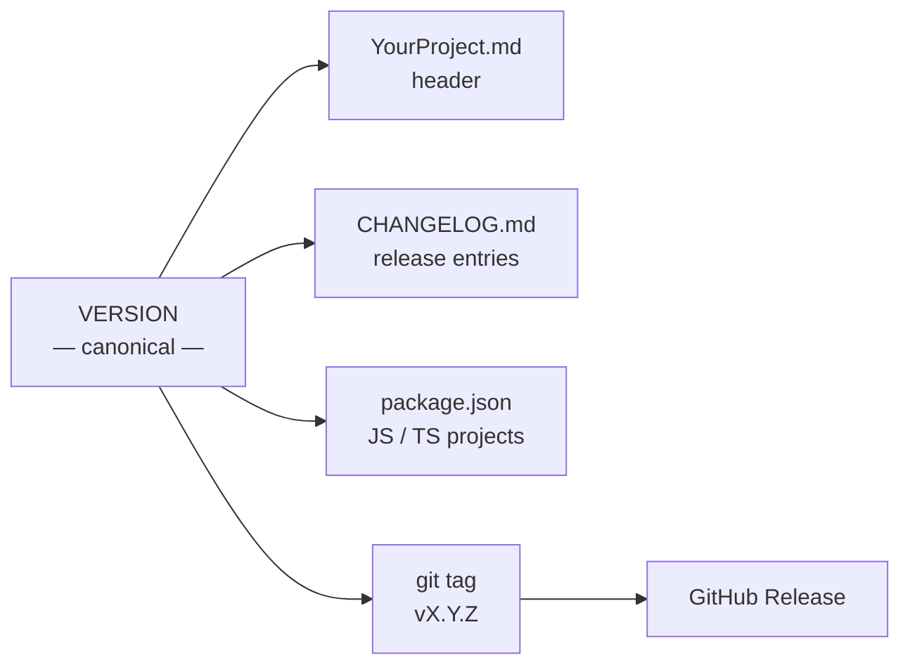
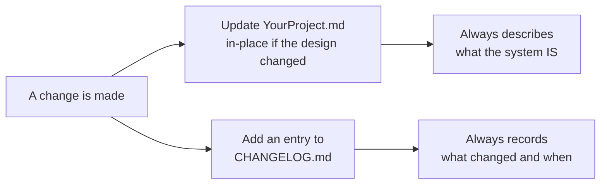
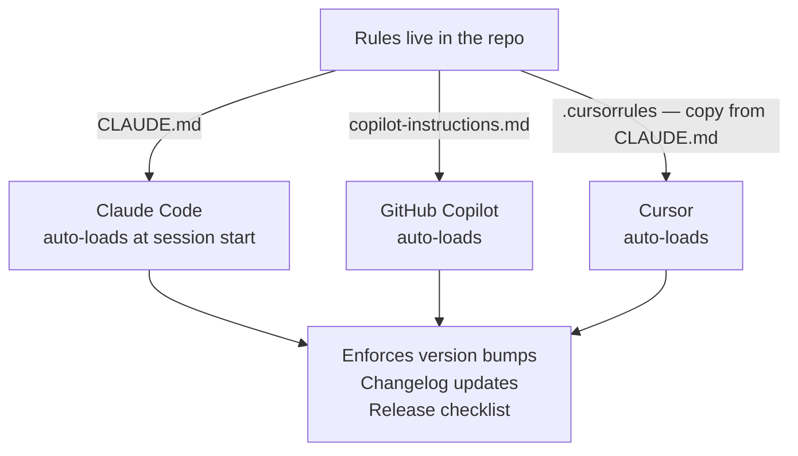
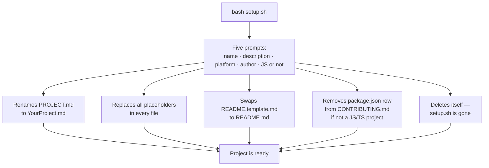

# Project Scaffold

**The project foundation you rebuild every time, built once.**

A GitHub template repository that gives every new project a professional-grade documentation system, automatic version discipline, and AI agent instructions — configured in five minutes, enforced forever.

---

## The problem

Starting a new project means making the same decisions and doing the same manual work every time. How should the system be documented? Where do version numbers live? How do changes get recorded? What context do AI tools need to work sensibly?

Without a deliberate foundation, things drift. Documentation goes stale. Changelogs go unwritten. Version numbers appear in three files and disagree. AI tools make changes without context and skip the release process entirely.

| Without a scaffold | With this scaffold |
|---|---|
| Docs set up differently every time | One template, consistent structure every project |
| Version numbers drift between files | One canonical number, propagated everywhere |
| Changelogs forgotten after the first week | Every change documented, automatically prompted |
| AI tools have no project context or rules | Standing orders baked into the repo |
| Release process done from memory | Checklist triggered by "ship it" or "done" |

---

## What you get

```
your-project/
├── README.md                     ← project README (personalised during setup)
├── YourProject.md                ← living system document — always current
├── CLAUDE.md                     ← AI agent standing orders
├── CONTRIBUTING.md               ← versioning and release rules
├── CHANGELOG.md                  ← chronological change record
├── VERSION                       ← single canonical version number
├── LICENSE                       ← MIT, with your name and year
├── .gitignore                    ← sensible defaults for most stacks
├── skills/
│   └── scribe.md                 ← documentation specialist skill
└── .github/
    └── copilot-instructions.md   ← GitHub Copilot reads this automatically
```

---

## How the system works

### One version number, everywhere

`VERSION` is the single source of truth. Every other location where the version appears is a mirror of it. When anything changes, all mirrors update together — never just one.



### The system document is not the diary

**`YourProject.md`** always describes what the system **is right now**. It is updated in-place as the system evolves. It is never a record of the past.

**`CHANGELOG.md`** is the diary — a chronological record of every change, with the version and date it happened.



### AI tools have standing orders

`CLAUDE.md` is read automatically by Claude Code at the start of every session. `.github/copilot-instructions.md` is read automatically by GitHub Copilot. Every AI tool working in this repo gets the same rules without any setup — bump the version, update the changelog, run the release checklist before shipping.



---

## Quick start

### Option 1 — GitHub template (recommended)

1. Click **Use this template** at the top of this page
2. Name your repo and choose public or private — the template's visibility does not constrain yours
3. Clone the new repo locally
4. Run the setup script:
   ```bash
   bash setup.sh
   ```
5. Answer five prompts: project name, one-line description, platform, author name, and whether it's a JS/TS project
6. Fill in `YourProject.md` with your system design and add project context to the bottom of `CLAUDE.md`

### Option 2 — Clone and reset

```bash
git clone <this-repo-url> my-project
cd my-project
rm -rf .git && git init
bash setup.sh
```

After setup, configure your remote before pushing:

```bash
git remote add origin <your-repo-url>
git push -u origin main
```

### What setup.sh does



---

## Versioning rules

This scaffold enforces Semantic Versioning (`MAJOR.MINOR.PATCH`). All projects start at `0.1.0`.

| Change type | Bump | Example |
|---|---|---|
| Bug fix, typo, small correction | **PATCH** | `0.1.0` → `0.1.1` |
| New feature, nothing breaks | **MINOR** | `0.1.1` → `0.2.0` |
| Breaking architectural change | **MAJOR** | `0.2.0` → `1.0.0` |

The full release process — how to tag, how to create a GitHub Release, what to do when you say "done" — is in `CONTRIBUTING.md` and enforced by `CLAUDE.md`.

---

## AI tool support

| Tool | File | How it works |
|---|---|---|
| **Claude Code** | `CLAUDE.md` | Automatically read from repo root at session start |
| **GitHub Copilot** | `.github/copilot-instructions.md` | Automatically read by Copilot |
| **Cursor** | `.cursorrules` | Create this file and copy the content from `CLAUDE.md` |
| **Other tools** | Any | Point the tool at `CLAUDE.md` or paste its contents into the tool's expected location |

All tools get the same instructions: never skip a version bump, always update the changelog, run the release checklist before shipping.

---

## Setting up as a GitHub template

1. Push this repo to GitHub
2. Go to **Settings → General**
3. Check **Template repository**

The **Use this template** button will appear on the repo page. Repos created from it can be public or private regardless of this repo's visibility.

---

## The philosophy

**Documentation is a living system, not a record of the past.**
The system document describes what exists right now. History lives in the changelog. They are different jobs, done by different files, and should never be confused.

**One version number, everywhere, always in sync.**
Version drift between files is a symptom of a broken process. This scaffold makes drift structurally impossible to ignore — every file that carries the version is listed, and the AI tools will tell you when they're out of sync.

**Discipline should be structural, not memorial.**
The rules are in the repo. The tools read them at the start of every session. You should not have to remember the release process — the system reminds you.

---

## License

MIT — use it however you like.
